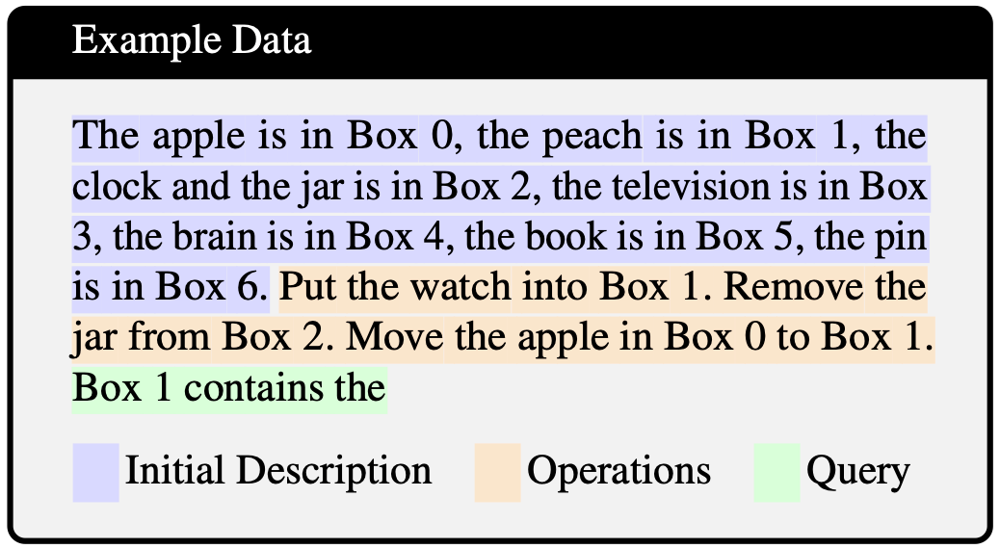

# Do Language Models Track Entities Across State Changes?

<p align="left">
  <a href="https://arxiv.org/abs/2605.30233v1">
    
  </a>
  <a href="https://github.com/PootieT/entity-tracking-mi/blob/main/LICENSE">
    
  </a>
</p>

This repo contains the code to reproduce the paper `Do Language Models Track Entities Across State Changes?` accepted in [ICML 2026](https://icml.cc/virtual/2026/poster/64207).

<p align="center">
  
</p>

# TL;DR

We investigate how language models solve entity tracking with state changing operations (See Example data above). 
We find that models *do not incrementally* keep track of global states (i.e. what objects are in each of the boxes) across context, instead dynamically 
pull information together only after the query phrase. Multiple state changes (operations like `Put`, `Move`, and `Remove`) are aggregated in **parallel** as models 
process the query at the last token across layers. We also find that the `Put` mechanism, which introduces objects to 
existing box, works similarly like entity binding circuit (with different heads, but the same functionality and uses the same subspaces).
The `Remove` operation works by tagging the removed object whose logit gets suppressed at query time. We call it the 
`Global Remove Hypothesis` as it removes the object globally from context, regardless of which box the objects are removed 
from! 

We also find many other interesting phenomenons from positional effect of remove, how might this explain CoT improvement
for entity tracking, and mechanistic difference between zero- and few-shot tracking! See our paper for detailed discussions!

## Environment

Open `environment.yml` and edit the prefix to set the location to your environment. Then run:
```commandline
conda env create -f environment.yml
```

Note, if you want to use NDIF remote for larger models like Llama3.1-70B, you will have to update `nnsight` to the latest version.

## Experiments

The repo is structured such that each experiment code is contained in its own folder. 

- `dataset_generation`: Code and run scripts needed to generate our box datasets. For the data we used for our paper, you can download them [here](https://drive.google.com/drive/folders/1UY6odU1hj-j7raBUwlOK2O4IYQS0R2NW?usp=share_link) (but generating them is pretty fast!). 
- `probe_experiments`: Code needed to train Local/Global/Mention probes, prior-state probes, ternary probes and intervention with ternary probes. Basic inference code is also here for behavioral results.
- `nnsight_pactching_experiments`: Code needed to run path patching or activation patching for `Put` analysis.
- `behavioral_experiments`: Code needed to run Logit/Rank Diff analysis for `Remove` operation.
- `scripts`: Run scripts for all experiments above.

Detailed information can be found in each of the repo.

## Citations

If you find this repo helpful or our paper interesting, consider citing:

```bibtex
@inproceedings{tang2026language,
  title={Do Language Models Track Entities Across State Changes?},
  author={Tang, Zilu and Zhao, Qiao and Franco, Gabriel and Wijaya, Derry and Mueller, Aaron and Schuster, Sebastian and Kim, Najoung},
  booktitle={Forty-Third International Conference on Machine Learning (ICML 2026)},
  year={2026}
}
```
