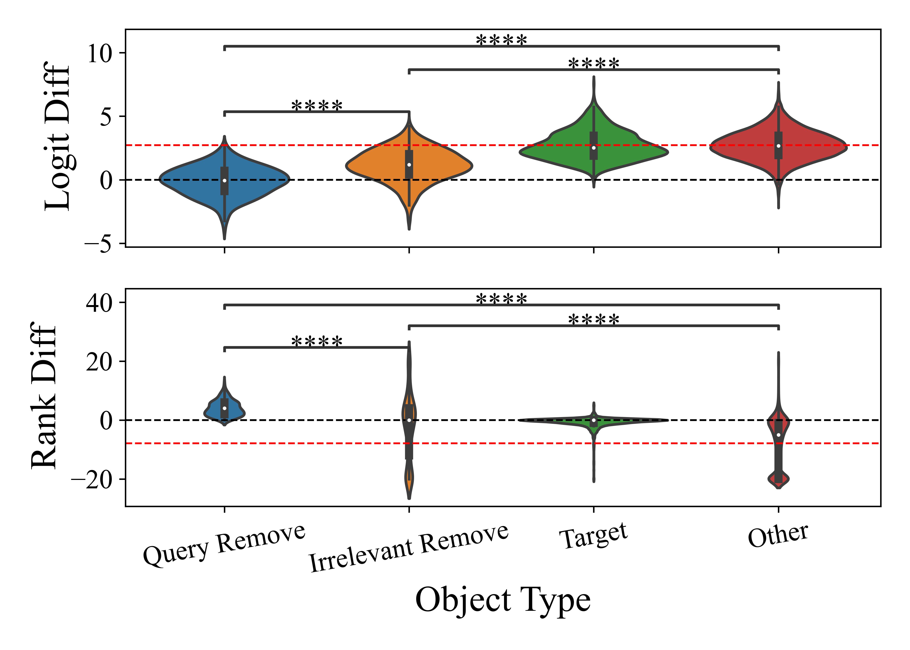

# Behavioral Analysis: Logits of Removed Object

To understand the effect of the `Remove` phrase has on the logit of objects in the context, we plot logit/rank diff of 
the objects like this:

<p align="center">
  
</p>

The script is 
```commandline
./scripts/run_behavioral_global_vs_local_remove.qsub
./scripts/run_behavioral_global_vs_local_put.qsub
```

To plot, the script is
```commandline
python behavioral_experiments/plot_behavioral_experiments.py
```