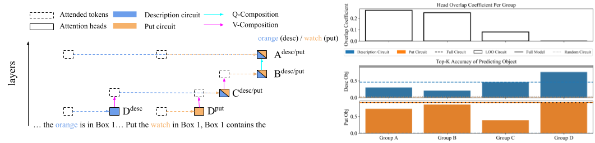
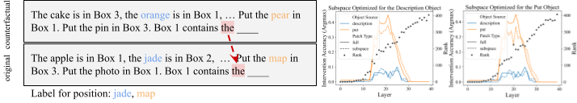

# Activation and Path Patching

In this directory, you will find experiments used for finding mechanisms for `Put`.


## Path Patching to find Put Circuit

<p align="center">
  
</p>

for `codellama13b` :
```commandline
./scripts/run_nnsight_patching_noop_codellama13b.qsub  # on no-op data
./scripts/run_nnsight_patching_1put_codellama13b.qsub  # on 1put data, metric using both description and put object
./scripts/run_nnsight_patching_1put_lastObjOnly_codellama13b.qsub  # on 1put data, metric using put object
./scripts/run_nnsight_patching_1put_notLastObj_codellama13b.qsub  # on 1put data, metric using description object
```

for `gemma-2-2b`:
```commandline
./scripts/run_nnsight_patching_noop_gemma2b.qsub  # on no-op data
./scripts/run_nnsight_patching_1put_gemma2b.qsub  # on 1put data, metric using both description and put object
./scripts/run_nnsight_patching_1put_lastObjOnly_gemma2b.qsub  # on 1put data, metric using put object
./scripts/run_nnsight_patching_1put_notLastObj_gemma2b.qsub  # on 1put data, metric using description object
```

These runs will output sorted score of all heads for that group. Note, when we ran the experiments for `gemma-2-2b`, we 
manually picked the top-k heads for each group, instead of using the elbow method.

## To Compute Evaluate Circuit (Faithfulness)

for `codellama13b`, the scripts are:
```commandline
./scripts/run_circuit_eval_noop_codellama13.qsub  # for no-op
./scripts/run_circuit_eval_1put_codellama13.qsub  # for 1put
./scripts/run_circuit_eval_1put_lastObjOnly_codellama13.qsub  # for put circuit
./scripts/run_circuit_eval_1put_notLastObj_codellama13.qsub  # for description circuit
```

for `gemma-2-2b`, these scripts are:
```commandline
./scripts/run_circuit_eval_noop_gemma2b.qsub  # for no-op
./scripts/run_circuit_eval_1put_gemma2b.qsub  # for 1put
```

Note for `gemma-2-2b`, we manually picked number of heads to eval, and current code uses the elbow method to find # heads.

## Cross-patching circuit

We want to see if groups are functionally similar across PUT/DESCRIPTION circuits, so for each group, we can evaluate 
circuit performance if we use all description circuit groups except one group from put.

that code is in 
```commandline
./script/run_circuit_cross_eval_1put_gemma2b.qsub
./script/run_circuit_cross_eval_1put_codellama13b.qsub
```

## Counterfactual activation patching (DCM) w/ subspace

<p align="center">
  
</p>

### Scripts to run
```commandline
./scripts/activation_patching/run_hypothesis_patching_dcm_1put_1put_irrelevant_codellama13b.qsub  # full activation patching
./scripts/activation_patching/run_hypothesis_subspace_patching_dcm_1put_1put_irrelevant_gemma2b.qsub  # subspace patching
./scripts/activation_patching/run_hypothesis_subspace_patching_dcm_1put_1put_irrelevant_subsetTarget_gemma2b.qsub  # subspace patching, optimizing for 1 object at a time.
./scripts/activation_patching/run_hypothesis_subspace_patching_dcm_1put_1put_irrelevant_subsetTarget_codellama13b.qsub # subspace patching, optimizing for 1 object at a time (paper experiment)
./scripts/activation_patching/run_hypothesis_patching_dcm_1remove.qsub  # prelim results on remove DCM patching
```
The important argument in the data filtering pipeline is `counterfactual={dcm_pos_phrase_ctf_op/dcm_obj}`, the first corresponds to Order ID hypothesis, second the Object content. These
correspond to function `generate_counterfactual_dcm_obj_or_pos` in `utils.py`.

Note, there are a couple of hyperparameters in the subspace patching script, mainly `lr` and `alpha`. see the hyperparameters in the qsub scripts and how you might choose one. but generally find the largest alpha (sparsest subset of basis) that preserves most of the performance.

### To plot results
For the full activation patching, the plotting code is in the python script `nnsight_patching_experiment/run_activation_patching_with_hypothesis.py`

For subspace patching, the circuit faithfulness plot is in the run script `nnsight_patching_experiment/run_subspace_patching.py`. 


