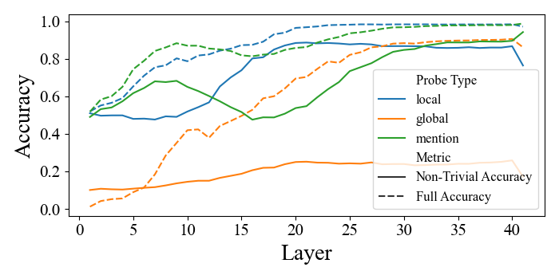
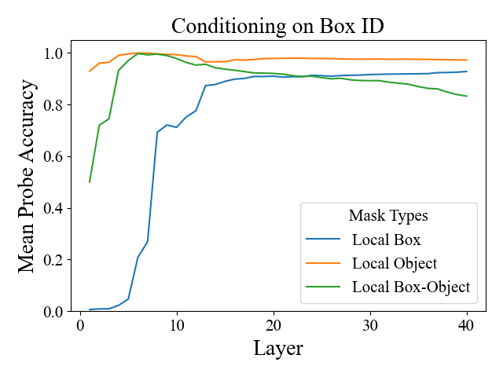
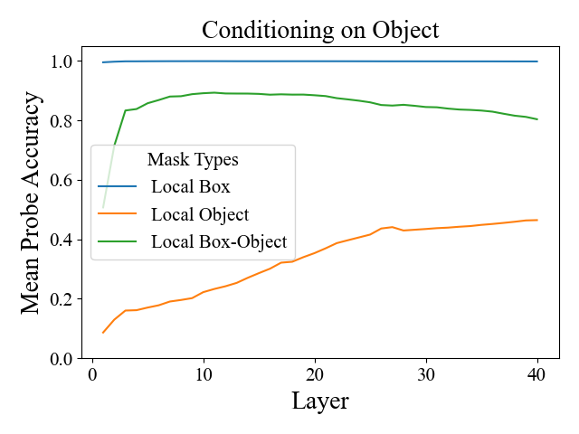
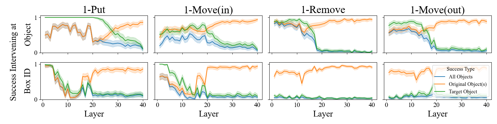

# entity-tracking-probing
probing experiments to understand entity tracking task

# Local / Global / Mention Probes  

<p align="center">
  
</p>

To cache model residual streams (last token). These are the same caches used for prior state probes.
```commandline
./scripts/probe_training/cache_representation_codellama13b.qsub  # using 2GPUs local
./scripts/probe_training/cache_representation_llama3_70B.qsub  # using NDIF
```

To train Local Probes
```commandline
./scripts/probe_training/load_and_train_local_probe_codellama13b.qsub  # using 1GPU local
./scripts/probe_training/load_and_train_local_probe_llama3_70B.qsub  # using NDIF
```

To train Global probes

```commandline
./scripts/probe_training/load_and_train_global_probe_codellama13b.qsub  # using 1GPU local
./scripts/probe_training/load_and_train_global_probe_llama3_70B.qsub  # using NDIF
```

To train mention probes

```commandline
./scripts/probe_training/load_and_train_mention_probe_codellama13b.qsub  # using 1GPU local
./scripts/probe_training/load_and_train_mention_probe_llama3_70B.qsub  # using NDIF
```

# Prior State Probes

<p align="center">
  
</p>


### Script
To cache hidden states (same as local/global probes)
```commandline
./scripts/probe_training/cache_representation_codellama13b.qsub  # using 2GPUs local
./scripts/probe_training/cache_representation_llama3_70B.qsub  # using NDIF
```

To train probe
```commandline
./scripts/load_and_train_probe_llama3_70B.qsub  # for llama3-70b
./scripts/load_and_train_probe_codellama13b.qsub  # for codellama 13b
```

# Remove Mechanism
## Ternary Probe Training

Conditioned on Box ID             |  Conditioned on Objects
:-------------------------:|:-------------------------:
  |  

In the code, sometimes the ternary probes are referred to as `phrase probe`.
### Script
To cache the model representation, see
```commandline
./scripts/cache_codellama13b_phrase_probe_activations.qsub
```
some important arguments here are
- `condition_on`: which token hidden states to condition the probe on: 
  - `object_all_local`: condition on object, local states
  - `number_all_local`: condition on box_id (in code I often refer to as `number`), local states
  - `number_all_cumulative`: condition on box_id, global states. When caching, this uses the same cache as `number_all_local`.

For `codellama13b`, make sure to use 2gpu torch run distributed w/ 16bit. (8bit cache does not result in good probes).
You will also notice qsub this with `#$ -pe omp 28` (28 cores), this is needed because we are storing a lot of hidden states needs lots of memories.

Now to load and train the probes, see
```commandline
./scripts/load_and_train_phrase_probe_codellama13b.qsub
/scripts/load_and_train_ternary_probe_llama3_70B.qsub
```

Since we need to train #layers amount of probes, for `codellama13b` I usually submit 4 jobs, each for-looping 10 probes 
(each probe takes around 20-30min to train)


### Data
The training data used here is in `boxes_altAlways_default_maxop12_5k`.
And specifically training uses `train-gpt.jsonl` and test uses `test-subsample-states-gpt.jsonl`. We need full train split
because the class label is very imbalanced with 700 probes.

## Intervention with Ternary Probes

<p align="center">
  
</p>

Before running intervention, we need to run baseline model inference to 1) get model behavioral accuracy and 2) get 
examples where model succeeds. The most important scripts are 
```commandline
./scripts/intervene_phrase_probe_codellama13b_8bit_null_1put.qsub  # null the 1 exist tag in query box
./scripts/intervene_phrase_probe_codellama13b_8bit_null_1remove.qsub  # null the 1 remove tag in query box
```

since we are only doing 100 examples in most cases, these should be <10 min each run/layer
